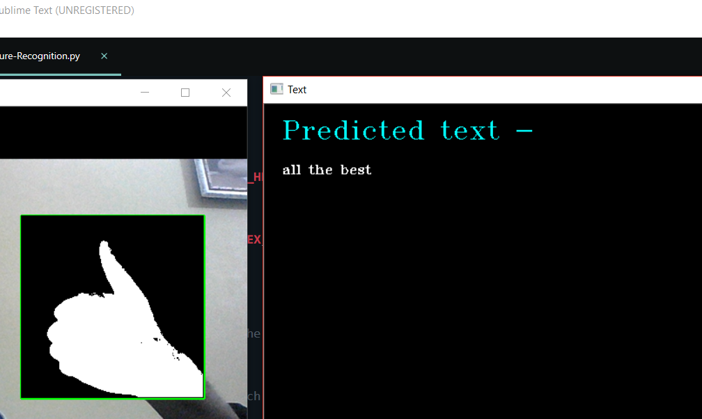
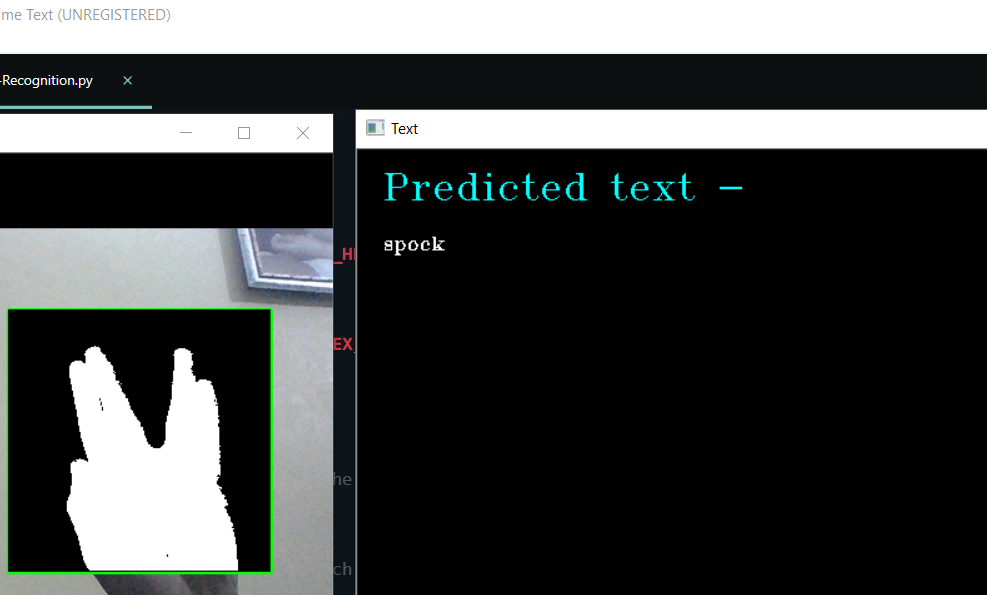
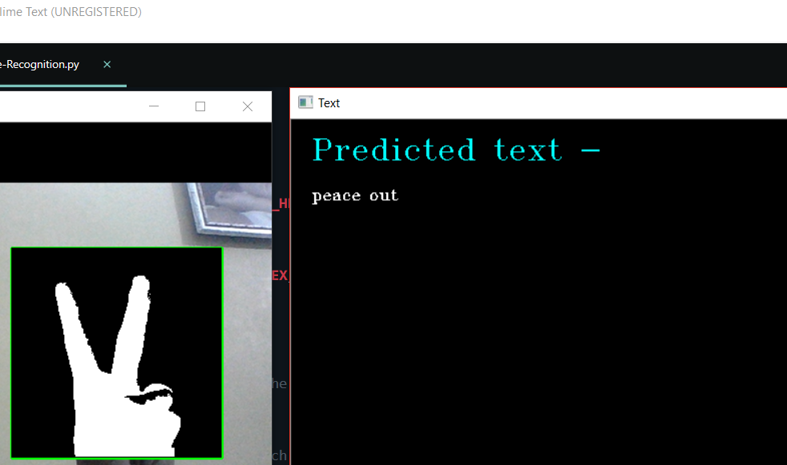
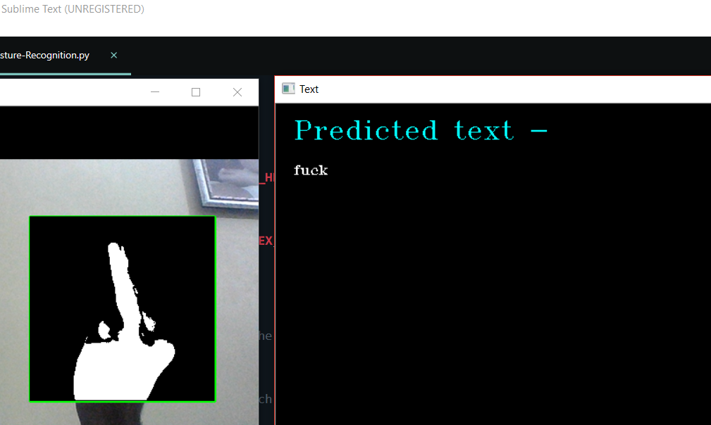
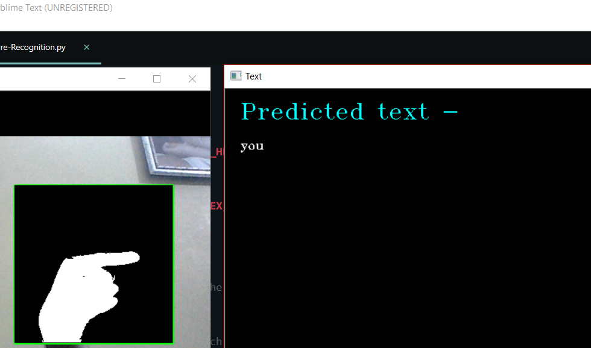

# Gesture-Recognition-ML
Basic gesture recognition project using CNN and OpenCV library.

## Requirements
` Open CV `

` Keras `

` Python3 `

## Demo
` all the best `

` spock `

` peace out `

` fuck `

` you `

